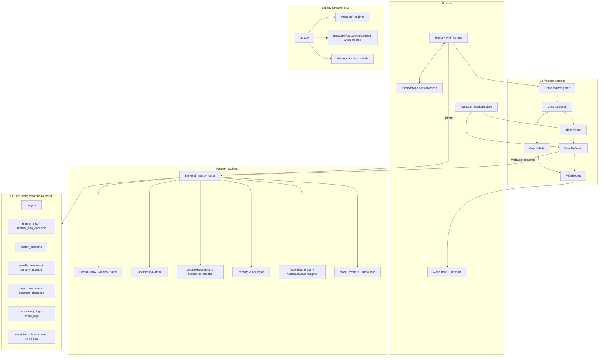

# FootballVerse AI Project Audit

Audit date: 2026-06-09  
Repository audited: `C:\Users\dibbh\Downloads\bucc_FootballVerseAI-main\bucc_FootballVerseAI-main`

## Audit Scope And Limitation

This audit is based on the complete repository contents, including:

- `docs/ARCHITECTURE.md`
- `docs/MASTER_PROMPT.md`
- `docs/IDENTITY_MATCHING.md`
- `backend/`
- `frontend/`
- `modules/`
- `app.py`
- `tests/`
- existing SQLite database file at `backend/footballverse.db`

The attached `FootballVerse-AI.pdf` exists one directory above the repo root, but this environment does not have a PDF text extraction tool or Python PDF library installed. A direct compressed-stream extraction also returned no text. The audit therefore uses the repository documents as the available vision source. The most explicit vision requirements found locally are in `docs/MASTER_PROMPT.md`: localhost web app, professional football platform styling, Player Mode, Coach Mode, Football DNA, browser penalty game, tactical board, commentary, report cards, leaderboard, prize/reward system, and Demo Mode.

## Executive Summary

FootballVerse AI currently contains two product tracks:

- A newer V3 React + FastAPI application that implements authentication, Football DNA identity scan, webcam/gesture-assisted penalty gameplay, adaptive goalkeeper logic, coach scenario simulation, reports, and persistent session history in SQLite.
- A legacy Streamlit MVP that implements a broader competition-demo feature set, including Demo Mode, leaderboard, reward tiers, check-in, Player Mode, Coach Mode, commentary, reports, and reusable game engines.

The V3 app is visually and architecturally closer to the target product, but it is missing several competition-critical features that only exist in the Streamlit MVP or are only partially implemented:

- No V3 leaderboard UI/API flow connected to completed sessions.
- No V3 prize/reward system.
- No V3 Demo Mode.
- Face matching is mostly an honest adapter fallback unless DeepFace and a Kaggle embedding index are manually provisioned.
- Commentary is mock/local by default; Ollama is a stub and there is no configurable provider selection.
- Share/export is text-only, not a polished card/image export.
- Database persistence relies heavily on JSON text fields and manual SQLite compatibility alters rather than proper migrations.
- Verification is blocked by missing local dependencies: `pytest`, `streamlit`, frontend `node_modules`/TypeScript CLI.

Competition readiness is moderate for a live guided demo and low-to-moderate for an unattended judged product. The fastest path to readiness is not a rewrite: consolidate the Streamlit leaderboard/reward/demo concepts into the V3 React + FastAPI app, add database-backed scoring and demo seeding, harden dependency setup, and make the face/AI fallback states judge-friendly and transparent.

## Current Architecture Diagram



## Current Codebase Structure

### V3 Frontend

Location: `frontend/`

Main files:

- `src/App.tsx`: Browser routing, login/register, local state persistence, protected routes.
- `src/api.ts`: REST client for V3 FastAPI endpoints.
- `src/components/IdentityScan.tsx`: webcam scan, playstyle selection, face frame capture, DNA reveal.
- `src/components/PenaltyGame.tsx`: webcam/gesture stream, manual gesture buttons, penalty session resume, fallback gameplay.
- `src/components/CoachMode.tsx`: coach identity selector, tactical scenario, draggable formation board, sliders, simulation.
- `src/components/FinalReport.tsx`: ultimate-card style report, radar chart, performance graph, text share.
- `src/components/WebcamCapture.tsx`: older reusable webcam/WebSocket component, not wired into primary routes.

Technology:

- React 19
- React Router 7
- Vite 8
- TypeScript
- CSS-only custom visual system

### V3 Backend

Location: `backend/`

Main files:

- `main.py`: FastAPI app, routes, persistence orchestration, event logging.
- `models.py`: SQLAlchemy ORM models.
- `schemas.py`: Pydantic schemas and validation helpers.
- `database.py`: SQLite engine, WAL mode, session dependency.
- `dna_engine.py`: deterministic DNA scoring/evolution for five supported archetypes.
- `game_logic.py`: adaptive deterministic penalty keeper and shot result model.
- `coach_mode.py`: tactical scenario generation and match simulation.
- `cv_engine.py`: MediaPipe Tasks hand gesture recognizer with optional disable/fallback.
- `face_identity.py`: optional DeepFace/Kaggle face embedding matcher with transparent fallback metadata.
- `llm_provider.py`: mock commentary provider plus Ollama stub.

### Legacy MVP

Location: `app.py`, `modules/`

The legacy Streamlit app still has useful features not fully ported to V3:

- Student check-in.
- Player Mode DNA questionnaire.
- Penalty game with scoring and reward tiers.
- Coach Mode tactical plan evaluation.
- Reports.
- Leaderboard.
- Prize/reward system.
- Demo Mode with seeded judge session.
- System page.

The legacy modules are more mature for scoring/reward/demo mechanics, but the user experience and architecture target should be the V3 React + FastAPI stack.

## Existing Features

### Authentication And Profile

Implemented in V3:

- Login/register endpoint: `POST /api/v3/auth/login`.
- Frontend login/register form.
- User profile persistence in SQLite `players`.
- Last login timestamp.
- LocalStorage persistence for frontend profile, DNA, player report, and coach result.
- Profile/history read endpoints:
  - `GET /api/v3/users/{player_id}`
  - `GET /api/v3/users/{player_id}/history`

Limitations:

- No password, SSO, admin, classroom, team, or judge authentication.
- User ID is a public identifier.
- LocalStorage is the primary frontend session mechanism.

### Football DNA

Implemented in V3:

- Initial DNA generation from playstyle answers.
- DNA profile fields: stats, traits, primary match, display name, style/archetype, special ability, suggested role, strength, weakness, confidence score/status, percentages.
- DNA persistence in `football_dna` and denormalized `players.football_dna_json`.
- DNA evolution after penalty session via match events.
- DNA evolution history table.
- Legacy DNA engine has a broader player pool: Messi, Ronaldo, Neymar, Haaland, Mbappe, Vinicius Jr, Van Dijk, De Bruyne, Salah.

Limitations:

- V3 DNA engine only supports Messi, Ronaldo, De Bruyne, Neymar, and Kante.
- V3 DNA questionnaire is one playstyle selector, not the richer 5-question legacy flow.
- DNA explainability is basic and not stored as structured reasons.
- DNA evolution is driven primarily by penalty events, not coach decisions or long-term trends.

### Identity Scan / Face Matching

Implemented in V3:

- Webcam access in frontend.
- Face frame capture to base64.
- Backend `FaceIdentityMatcher` status endpoint.
- Optional DeepFace matching path against a Kaggle football face embedding index.
- Honest fallback metadata when DeepFace, dataset, index, or frame is unavailable.
- UI displays `Face Match` or `Adapter Fallback`.

Limitations:

- No dataset or embedding index is present in the repo.
- DeepFace is optional and not installed in this environment.
- No index generation script exists.
- No consent, privacy, retention, or deletion flow for face frames.
- Face images are not persisted, which is safer, but there is no explicit privacy notice in-app.

### Penalty Game

Implemented in V3:

- 5-shot penalty session.
- REST session start, shot execution, completion, and session resume.
- WebSocket video stream at `/ws/video`.
- MediaPipe gesture detection when dependencies/model are available.
- Offline/manual gesture fallback buttons.
- Gesture-to-shot mapping:
  - Point Left -> Left Shot / Left Corner
  - Point Right -> Right Shot / Right Corner
  - Point Up -> Top Corner
  - Point Down -> Low Shot
  - Pinch -> Panenka
  - Fist/Power Shot -> Power Shot
- Adaptive deterministic keeper logic.
- Difficulty selection: Easy, Medium, Hard, Legendary.
- Power and curve registration.
- Commentary per shot.
- Session resume from backend and localStorage.
- Final report generation.

Limitations:

- Gameplay is still a simple penalty loop, not a broader match or skill challenge system.
- No calibration flow for webcam/gesture reliability.
- WebSocket URL is hardcoded to `ws://localhost:8000/ws/video`.
- Gesture confidence is not surfaced deeply in the UI.
- No anti-cheat, input replay validation, or authoritative frontend/backend state reconciliation.

### Coach Mode

Implemented in V3:

- Coach identity selector.
- Scenario generation endpoint.
- Tactical sliders: attack, defense, possession, pressure, width.
- Formation selector.
- Draggable formation board.
- Role assignments for ST, DM, LW, RW.
- Simulation endpoint.
- Timeline, final score, explanation, key event, tactical rating, ranking.
- Persistence to `match_sessions`, `coach_sessions`, and `coaching_decisions`.

Limitations:

- Tactical board positions are persisted only inside tactics JSON, not as queryable structured rows.
- Coach styles are labels; they do not deeply alter model behavior.
- Simulation uses random events and simple heuristics.
- No scenario library management, difficulty tiers, or judge replay.
- Coach results do not currently feed DNA evolution.

### Commentary

Implemented:

- V3 mock provider with styles:
  - Professional
  - Emotional Uncle
  - Conspiracy Analyst/Theorist
  - Robot AI/Robot Learning Football
- Match story generation.
- Legacy commentary module has 24 styles and richer templates.
- Commentary logs persisted for penalty sessions.

Limitations:

- Ollama provider is a stub, not a real HTTP integration.
- Provider selection is hardcoded to mock.
- No prompt templates, safety filters, latency fallback policy, or model configuration.
- Coach commentary is limited compared with penalty commentary.

### Reports And Sharing

Implemented in V3:

- Player report after penalty completion.
- DNA before/after.
- Evolution label.
- Goals, accuracy, reaction time, best skill, weakness, suggested role.
- Radar chart.
- Performance graph.
- Ultimate-card style visual.
- Coach classification section.
- Web Share or clipboard text sharing.

Limitations:

- No image export/download.
- No persistent report detail endpoint by report ID.
- No public share page.
- Report card cannot be re-opened from backend history as a full report object.
- No certificate/prize claim artifact.

### Leaderboard And Rewards

Implemented in legacy Streamlit:

- `students` table.
- `score_events` table.
- Leaderboard sections.
- Prize tiers: Gold, Silver, Bronze, Participation.
- Demo seed data.

Partially implemented in V3:

- `leaderboard` ORM table exists.

Missing in V3:

- No route writes to V3 `leaderboard`.
- No V3 leaderboard endpoints.
- No V3 leaderboard UI.
- No V3 prize tier calculation.
- No V3 reward claim or judge dashboard.

### Demo Mode

Implemented in legacy Streamlit:

- Seed demo leaderboard.
- Instant judge session.

Missing in V3:

- No Demo Mode route or UI.
- No seeded judge data endpoint.
- No one-click deterministic demo setup.

### Observability And Event Logs

Implemented in V3:

- `event_logs` table.
- Events logged for login, DNA updates, match start/completion, gesture detected, shot executed, goal/save/miss.

Limitations:

- No event log viewer.
- No telemetry dashboard.
- No structured analytics tables beyond generic JSON payloads.
- No request IDs or trace IDs.

### Tests And Verification

Existing tests:

- Legacy engine tests for DNA, penalties, coach simulation, commentary, database/validation.
- Backend FastAPI tests in `backend/test_main.py`.

Verification performed:

- `python -m pytest -q`: failed because `pytest` is not installed.
- `python -m unittest discover -v`: failed because `backend/test_main.py` imports `pytest`.
- `python -m unittest discover -s tests -v`: ran 60 tests, 59 passed, 1 errored because `streamlit` is not installed.
- `npm.cmd run build`: failed because `tsc` is not available, likely because frontend dependencies are not installed in `node_modules`.

## Existing Database Schema

### V3 SQLite Database

File: `backend/footballverse.db`

Current tables:

- `players`
- `football_dna`
- `football_dna_evolution`
- `match_sessions`
- `penalty_sessions`
- `penalty_attempts`
- `coach_sessions`
- `coaching_decisions`
- `commentary_logs`
- `event_logs`
- `leaderboard`

Important observations:

- SQLite WAL mode is enabled.
- SQLAlchemy creates tables on app startup.
- `main.py` manually alters existing tables for compatibility.
- Many fields are stored as JSON text.
- The V3 `leaderboard` table exists but is not functionally integrated.
- No Alembic migrations or schema versioning exists.
- Foreign keys are declared, but SQLite foreign key enforcement is not explicitly enabled with `PRAGMA foreign_keys=ON`.

### Legacy Streamlit Database

Configured file: `database/footballverse.sqlite3`

Current status:

- File does not exist until the Streamlit app or `LeaderboardStore` creates it.

Legacy schema:

- `students`
- `score_events`

This schema powers rewards, prize tiers, leaderboard sections, and demo seed data in the Streamlit MVP.

## Missing Features List

### Critical For Competition Demo

1. V3 Demo Mode
   - One-click judge profile.
   - Seeded DNA, penalty session, coach session, leaderboard.
   - Reset demo state.
   - Deterministic scenario and outcomes for reliable judging.

2. V3 Leaderboard
   - Backend scoring endpoint.
   - Leaderboard read endpoint.
   - Frontend leaderboard page.
   - Sections: best player, best coach, highest accuracy, newest attempts.
   - Score tie-breakers and timestamp display.

3. V3 Prize/Reward System
   - Prize tier calculation.
   - Reward eligibility shown after report.
   - Reward claim status.
   - Judge/admin confirmation flow.

4. Dependency And Run Reliability
   - Root README with exact startup commands.
   - Backend requirements file.
   - Optional CV/DeepFace requirements file.
   - Frontend dependency installation instructions.
   - Scripts for dev startup and test verification.

5. Full Report Persistence
   - Store final report as a first-class record.
   - Reopen report by ID.
   - Link report to leaderboard entry and reward tier.

### High Priority Product Gaps

6. Face Matching Production Path
   - Dataset setup docs.
   - Embedding index generation script.
   - DeepFace dependency isolation.
   - Index validation endpoint.
   - Clear user consent and privacy copy.

7. Shareable Card Export
   - Generate PNG from report card.
   - Download button.
   - Optional QR/public code for judge replay.

8. Unified Scoring Model
   - V3 currently has goals/accuracy/report rating, while legacy has point-based reward scoring.
   - Define one scoring formula for player and coach modes.
   - Persist score components and final score.

9. Coach Mode Depth
   - Structured tactical board persistence.
   - More scenario templates.
   - Coach style modifiers.
   - Tactical feedback tied to exact choices.
   - DNA evolution from coaching decisions.

10. Gesture Calibration
   - Pre-game webcam permission state.
   - Gesture tutorial/calibration.
   - Confidence meter.
   - Fallback explanation when CV is unavailable.

### Medium Priority Gaps

11. User History UX
   - V3 backend has history endpoints, but frontend has no full history page.

12. Admin/Judge Mode
   - View sessions.
   - Verify winners.
   - Clear demo data.
   - Export CSV.

13. Real AI Commentary
   - Implement Ollama HTTP calls or another configured provider.
   - Add timeout/fallback.
   - Store provider metadata.
   - Use different prompts for shot, match story, coach analysis.

14. Better Database Migration System
   - Replace ad hoc `ALTER TABLE` compatibility block with Alembic migrations.
   - Add seed scripts.

15. Security Hardening
   - CORS currently allows all origins.
   - No rate limits.
   - No auth token.
   - No admin authorization.
   - No privacy policy for camera/face use.

16. Accessibility And Responsive QA
   - Manual keyboard/focus testing.
   - Reduced-motion handling.
   - Screen reader labels for game controls.
   - Mobile layout verification.

17. CI
   - Automated backend tests.
   - Frontend typecheck/build.
   - Lint.
   - Dependency installation check.

## Missing Database Requirements

The current schema is enough for a prototype, but a competition-ready V3 app needs a normalized schema around users, sessions, reports, scoring, leaderboard, rewards, demo data, and AI/CV metadata.

### Required Schema Additions

```sql
-- App-level schema/version control
CREATE TABLE schema_migrations (
    version VARCHAR PRIMARY KEY,
    applied_at DATETIME NOT NULL
);

-- Separate auth/profile identity from gameplay player row if auth grows later
CREATE TABLE user_accounts (
    id VARCHAR PRIMARY KEY,
    display_name VARCHAR NOT NULL,
    role VARCHAR NOT NULL DEFAULT 'participant', -- participant, judge, admin
    created_at DATETIME NOT NULL,
    last_login_at DATETIME,
    consent_camera BOOLEAN NOT NULL DEFAULT 0,
    consent_face_processing BOOLEAN NOT NULL DEFAULT 0,
    consent_updated_at DATETIME
);

-- Full structured DNA snapshots
CREATE TABLE dna_profiles (
    id INTEGER PRIMARY KEY AUTOINCREMENT,
    user_id VARCHAR NOT NULL,
    primary_match VARCHAR NOT NULL,
    display_name VARCHAR NOT NULL,
    archetype VARCHAR,
    style VARCHAR,
    special_ability VARCHAR,
    suggested_role VARCHAR,
    strength VARCHAR,
    weakness VARCHAR,
    confidence_score FLOAT,
    confidence_status VARCHAR,
    source VARCHAR NOT NULL, -- quiz, face_adapter, deepface, evolution, demo_seed
    profile_json TEXT NOT NULL,
    created_at DATETIME NOT NULL,
    FOREIGN KEY(user_id) REFERENCES user_accounts(id)
);

-- Identity scan audit metadata without storing raw face frames by default
CREATE TABLE identity_scans (
    id INTEGER PRIMARY KEY AUTOINCREMENT,
    user_id VARCHAR NOT NULL,
    dna_profile_id INTEGER,
    status VARCHAR NOT NULL, -- deepface_confirmed, adapter_fallback, failed
    matching_method VARCHAR,
    face_detected BOOLEAN NOT NULL DEFAULT 0,
    confidence_score FLOAT,
    best_face_candidate VARCHAR,
    fallback_reason TEXT,
    dataset_path TEXT,
    index_path TEXT,
    embedding_model VARCHAR,
    created_at DATETIME NOT NULL,
    FOREIGN KEY(user_id) REFERENCES user_accounts(id),
    FOREIGN KEY(dna_profile_id) REFERENCES dna_profiles(id)
);

-- First-class report records
CREATE TABLE reports (
    id INTEGER PRIMARY KEY AUTOINCREMENT,
    user_id VARCHAR NOT NULL,
    match_session_id INTEGER,
    mode VARCHAR NOT NULL, -- Player, Coach, Combined
    title VARCHAR,
    rating INTEGER,
    summary_json TEXT NOT NULL,
    share_slug VARCHAR UNIQUE,
    export_image_path TEXT,
    created_at DATETIME NOT NULL,
    FOREIGN KEY(user_id) REFERENCES user_accounts(id),
    FOREIGN KEY(match_session_id) REFERENCES match_sessions(id)
);

-- Unified scoring for rewards/leaderboard
CREATE TABLE score_entries (
    id INTEGER PRIMARY KEY AUTOINCREMENT,
    user_id VARCHAR NOT NULL,
    match_session_id INTEGER,
    report_id INTEGER,
    mode VARCHAR NOT NULL,
    final_score INTEGER NOT NULL,
    goals INTEGER DEFAULT 0,
    accuracy FLOAT DEFAULT 0,
    reaction_time FLOAT DEFAULT 0,
    tactical_rating INTEGER DEFAULT 0,
    coach_rank VARCHAR,
    dna_match VARCHAR,
    scoring_version VARCHAR NOT NULL,
    created_at DATETIME NOT NULL,
    FOREIGN KEY(user_id) REFERENCES user_accounts(id),
    FOREIGN KEY(match_session_id) REFERENCES match_sessions(id),
    FOREIGN KEY(report_id) REFERENCES reports(id)
);

-- Prize and reward tracking
CREATE TABLE reward_tiers (
    id INTEGER PRIMARY KEY AUTOINCREMENT,
    name VARCHAR NOT NULL UNIQUE,
    min_score INTEGER NOT NULL,
    max_score INTEGER,
    description TEXT,
    sort_order INTEGER NOT NULL
);

CREATE TABLE reward_claims (
    id INTEGER PRIMARY KEY AUTOINCREMENT,
    user_id VARCHAR NOT NULL,
    score_entry_id INTEGER NOT NULL,
    reward_tier_id INTEGER NOT NULL,
    status VARCHAR NOT NULL DEFAULT 'eligible', -- eligible, claimed, rejected, expired
    claimed_at DATETIME,
    verified_by VARCHAR,
    notes TEXT,
    FOREIGN KEY(user_id) REFERENCES user_accounts(id),
    FOREIGN KEY(score_entry_id) REFERENCES score_entries(id),
    FOREIGN KEY(reward_tier_id) REFERENCES reward_tiers(id),
    FOREIGN KEY(verified_by) REFERENCES user_accounts(id)
);

-- Queryable leaderboard snapshots for performance and judge stability
CREATE TABLE leaderboard_snapshots (
    id INTEGER PRIMARY KEY AUTOINCREMENT,
    scope VARCHAR NOT NULL, -- overall, player, coach, accuracy
    generated_at DATETIME NOT NULL,
    entries_json TEXT NOT NULL
);

-- Demo mode seed and reset tracking
CREATE TABLE demo_sessions (
    id INTEGER PRIMARY KEY AUTOINCREMENT,
    demo_code VARCHAR NOT NULL UNIQUE,
    user_id VARCHAR NOT NULL,
    seeded_by VARCHAR,
    seed_payload_json TEXT NOT NULL,
    active BOOLEAN NOT NULL DEFAULT 1,
    created_at DATETIME NOT NULL,
    reset_at DATETIME,
    FOREIGN KEY(user_id) REFERENCES user_accounts(id)
);

-- Structured tactical board positions
CREATE TABLE coach_player_positions (
    id INTEGER PRIMARY KEY AUTOINCREMENT,
    coach_session_id INTEGER NOT NULL,
    token_id INTEGER NOT NULL,
    label VARCHAR NOT NULL,
    x FLOAT NOT NULL,
    y FLOAT NOT NULL,
    role VARCHAR,
    assignment VARCHAR,
    FOREIGN KEY(coach_session_id) REFERENCES coach_sessions(id)
);

-- AI provider observability
CREATE TABLE ai_generation_logs (
    id INTEGER PRIMARY KEY AUTOINCREMENT,
    user_id VARCHAR,
    session_type VARCHAR,
    session_id INTEGER,
    provider VARCHAR NOT NULL,
    model VARCHAR,
    prompt_type VARCHAR NOT NULL,
    input_json TEXT,
    output_text TEXT,
    latency_ms INTEGER,
    status VARCHAR NOT NULL,
    error TEXT,
    created_at DATETIME NOT NULL
);

-- CV health and gesture telemetry
CREATE TABLE gesture_events (
    id INTEGER PRIMARY KEY AUTOINCREMENT,
    user_id VARCHAR NOT NULL,
    penalty_session_id INTEGER,
    gesture VARCHAR,
    confidence FLOAT,
    power FLOAT,
    curve FLOAT,
    source VARCHAR NOT NULL, -- mediapipe, manual_button, fallback
    frame_latency_ms INTEGER,
    created_at DATETIME NOT NULL,
    FOREIGN KEY(user_id) REFERENCES user_accounts(id),
    FOREIGN KEY(penalty_session_id) REFERENCES penalty_sessions(id)
);
```

### Required Schema Changes To Existing Tables

Recommended changes:

- Add `created_by_demo_session_id` nullable FK to `players`, `match_sessions`, `reports`, and `score_entries`.
- Add `scoring_version` to `penalty_sessions` and `coach_sessions`.
- Add `status` values consistently across session tables: `active`, `completed`, `abandoned`, `demo`.
- Add `FOREIGN KEY(match_session_id)` constraints where current altered columns exist without constraints.
- Add `ON DELETE` behavior intentionally, rather than relying on defaults.
- Add indexes:
  - `score_entries(mode, final_score DESC)`
  - `score_entries(user_id, created_at DESC)`
  - `reports(user_id, created_at DESC)`
  - `identity_scans(user_id, created_at DESC)`
  - `reward_claims(status, created_at DESC)`
  - `gesture_events(penalty_session_id, created_at)`

### Data Model Consolidation Recommendation

Do not keep separate production databases for Streamlit and V3. Port the useful legacy concepts into the V3 database:

- `students` -> `user_accounts` or `players`
- `score_events` -> `score_entries`
- `reward_tier()` -> `reward_tiers` + service function
- legacy demo seed -> `demo_sessions` + seed endpoint

## Development Roadmap

### Phase 0: Stabilize Local Run And Verification

Goal: make the project installable and verifiable on a judge/developer laptop.

Tasks:

- Add backend dependency file with FastAPI, SQLAlchemy, Pydantic, pytest, httpx, and optional groups for Streamlit/CV/DeepFace.
- Add frontend install/build instructions.
- Add root README with V3 startup:
  - backend: FastAPI on `localhost:8000`
  - frontend: Vite on `localhost:5173`
- Add `.env.example` for:
  - `VITE_API_BASE_URL`
  - `FOOTBALLVERSE_DISABLE_CV`
  - `FOOTBALLVERSE_FACE_DATASET_PATH`
  - `FOOTBALLVERSE_FACE_INDEX_PATH`
  - `FOOTBALLVERSE_FACE_CONFIDENCE_THRESHOLD`
- Decide whether Streamlit remains supported or is archived as legacy.
- Fix test dependency assumptions.
- Add a single verification command for backend tests.
- Add frontend build verification once dependencies are installed.

Acceptance criteria:

- New machine can install and run app from README.
- Backend tests run without missing `pytest`.
- Frontend build runs without missing `tsc`.
- Optional features fail gracefully with documented fallbacks.

### Phase 1: Bring Competition Features Into V3

Goal: make the React + FastAPI app feature-complete relative to the local vision docs.

Tasks:

- Add V3 leaderboard service and endpoints:
  - `GET /api/v3/leaderboard`
  - `GET /api/v3/leaderboard/sections`
  - `POST /api/v3/leaderboard/recalculate` for admin/demo use.
- Add unified scoring from player reports and coach simulations.
- Write score entries when penalty/coach sessions complete.
- Add prize tier calculation and reward eligibility.
- Add V3 Leaderboard/Rewards screen.
- Add V3 Demo Mode:
  - seed judge profile
  - seed demo leaderboard
  - preloaded DNA
  - deterministic coach scenario
  - reset demo state
- Add history page that reads `GET /api/v3/users/{player_id}/history`.

Acceptance criteria:

- A judge can start a demo, complete player and coach flows, see leaderboard placement, and see reward tier without touching Streamlit.

### Phase 2: Data Model And Persistence Hardening

Goal: make stored data reliable, queryable, and migration-safe.

Tasks:

- Introduce Alembic migrations.
- Create first-class `reports`, `score_entries`, `reward_tiers`, `reward_claims`, and `identity_scans`.
- Backfill existing SQLite data if needed.
- Enable SQLite foreign key enforcement.
- Reduce critical JSON-only fields by extracting important fields into columns.
- Add report-by-ID endpoint.
- Add share slug generation.
- Add admin/judge export endpoint.

Acceptance criteria:

- Reports and scores survive refresh and can be reopened from backend history.
- Leaderboards are database-backed and deterministic.
- Schema changes no longer rely on manual compatibility alters in `main.py`.

### Phase 3: Identity, CV, And AI Quality

Goal: make the "AI" parts credible while keeping fallback honesty.

Tasks:

- Add face index generation script for Kaggle dataset.
- Add dataset/index validation command.
- Add in-app privacy/consent notice before face scan.
- Add gesture calibration screen.
- Add CV health endpoint.
- Store gesture telemetry.
- Implement real Ollama provider or remove the stub from the demo path.
- Add provider config and timeout/fallback rules.
- Port selected legacy commentary styles to V3.

Acceptance criteria:

- Demo can show either a confirmed face path or a clear fallback path.
- Gesture detection has a judge-friendly calibration/status explanation.
- Commentary provider status is visible and reliable.

### Phase 4: Report Polish And Sharing

Goal: make outputs feel competition-ready and shareable.

Tasks:

- Add PNG export for report card.
- Add public/local report view by share slug.
- Add QR code for report/leaderboard entry.
- Add richer combined player + coach report.
- Add reward certificate screen.
- Improve mobile responsiveness and accessibility.

Acceptance criteria:

- User can export a polished report image.
- Judge can reopen a report from a link/code.
- Report includes player, coach, score, reward tier, and DNA evolution.

### Phase 5: Production Readiness

Goal: prepare for deployment beyond a local demo.

Tasks:

- Replace permissive CORS with environment-specific origins.
- Add auth/session token if multi-user deployment is planned.
- Add admin role.
- Add rate limits.
- Add structured logging.
- Add CI for backend and frontend.
- Add Docker/devcontainer option.
- Consider PostgreSQL if multiple concurrent users are expected.

Acceptance criteria:

- The app can be deployed or run at an event with repeatable setup, logs, backups, and admin controls.

## Competition Readiness Assessment

### Scorecard

| Area | Status | Readiness |
| --- | --- | --- |
| Core concept | Strong, clear football AI demo idea | High |
| Visual impact | V3 has strong stadium/broadcast styling | High |
| Player Mode | Implemented with penalty game and reports | Medium-high |
| Coach Mode | Implemented with tactical board and simulation | Medium |
| Football DNA | Implemented, but V3 pool/questionnaire is narrow | Medium |
| Gesture/CV | Implemented optionally with fallback | Medium |
| Face matching | Transparent fallback; production path incomplete | Low-medium |
| Commentary | Mock works; real AI provider incomplete | Medium |
| Reports | Good UI; export/persistence incomplete | Medium |
| Leaderboard | Legacy only; V3 incomplete | Low |
| Rewards/prizes | Legacy only; V3 missing | Low |
| Demo Mode | Legacy only; V3 missing | Low |
| Database | Prototype persistence works; needs migrations/schema | Medium-low |
| Testability | Tests exist; dependency setup blocks full run | Medium-low |
| Setup reliability | Missing root dependency/run path | Low-medium |

### Current Demo Strategy

Best current demo path:

1. Use the V3 React + FastAPI app for visual impact and primary product story.
2. Explain face matching as an adapter with honest fallback unless DeepFace/index is provisioned.
3. Use manual gesture buttons if webcam/CV is unreliable.
4. Use legacy Streamlit only if leaderboard/rewards/demo mode must be shown today.

This two-app story is risky for competition because judges may see fragmentation. The roadmap should prioritize moving leaderboard, rewards, and demo mode into V3.

### Biggest Risks

- Dependency setup failure during judging.
- V3 lacks leaderboard/reward/demo features named in the product vision.
- Face AI may be perceived as fake unless fallback is clearly framed.
- Hardcoded localhost WebSocket/API assumptions can break if ports differ.
- No single "start the demo" command.
- No image export for the report card.

### Fastest Readiness Win

The highest-impact short sprint is:

1. Add V3 Demo Mode.
2. Add V3 leaderboard/reward endpoints and UI.
3. Save unified scores after player and coach sessions.
4. Add a root README and dependency setup.
5. Add report image export or at least persistent report reopen.

That would align the V3 app with the local vision document without rewriting the core engines.

## Final Recommendation

Treat the V3 React + FastAPI app as the product target. Treat the Streamlit app as a feature reference and fallback demo only. The project already has enough core logic to become competition-ready quickly, but the missing V3 leaderboard, rewards, demo mode, full report persistence, dependency setup, and database migration path should be addressed before adding more gameplay complexity.

## Continuation Log - 2026-06-12

This section was added after resuming from a previous model/token-limit handoff. The worktree already contained substantial prior edits beyond the original audit, including V3 Fan Mode, Leaderboards, audio helpers, Player Arena CV changes, Coach Mode segment simulation, and updated backend endpoints. Those prior edits were preserved.

### Fixes Applied In This Continuation

| ID | Location | Severity | Nature | Reproduction | Fix Applied |
| --- | --- | --- | --- | --- | --- |
| A1-CV-Release | `backend/cv_engine.py`, `GestureRecognizer.process_frame` | Critical | Fist release state machine bug. The backend emitted `Charging` frames but did not persist that a fist was active, so the next non-fist frame could fail to emit `Fist Released`. | Hold a closed fist, then open/release. Power may charge but shot release does not dispatch reliably. | Set `self.last_gesture = "Charging"` before returning the charging response, allowing the release branch to fire on the next non-fist frame. |
| D1-DNA-Persist | `backend/main.py`, `_upsert_dna` | High | DNA profile persistence regression. The ORM DNA row was updated, but `players.football_dna_json` was not refreshed, causing profile reloads to lose current DNA data. | Complete identity scan, reload/login later, inspect returned user profile DNA. | Restored `player.football_dna_json = _json_dumps(profile)` inside `_upsert_dna`. |
| A8-Leaderboard-BestScore | `backend/main.py`, `_upsert_leaderboard` | High | Lower later scores could overwrite/downgrade a leaderboard title even though the stored score kept the max. | Post a high score, then post a lower score for the same player/mode. | Preserve the previous best score and only update custom title when the new score is at least the prior best; fill missing title from thresholds if needed. |
| A8-Leaderboard-Top100 | `backend/main.py`, `_upsert_leaderboard` | Medium | API limited reads to 100, but did not enforce the top-100 cap server-side in storage. | Insert more than 100 leaderboard rows for one mode. | After reranking each mode, delete entries after index 100 before commit. |
| A6-Coach-Title | `backend/main.py`, `complete_coach_match`; `frontend/src/api.ts`; `frontend/src/types.ts`; `frontend/src/components/CoachMode.tsx`; `frontend/src/components/FinalReport.tsx` | Medium | Manager title was stored backend-side but not returned/displayed consistently in the frontend report. | Complete Coach Mode and view final report. | Return `manager_title` from `/api/v3/coach/complete`, type it in the API/client model, persist it in `CoachResult`, and display it in `FinalReport`. |
| A5/A6-Coach-HT-Timer | `frontend/src/components/CoachMode.tsx` | High | Half-time could be skipped early with "Ready for Second Half", violating the 60-second blocking requirement. Segment display also counted half-time as a match segment. | Reach half-time and click the ready button immediately; observe second half starts before timer ends. | Removed early progression button, added lock message, and changed segment header to show six playable 15-minute segments rather than seven including HT. |
| D7-Fan-Error-State | `frontend/src/components/FanMode.tsx`; `frontend/src/App.css` | Medium | Fan Mode start failure could leave the app stuck on a loading screen or render `null` for a missing challenge. | Stop backend or make `/api/v3/fan/start` fail, then open Fan Trivia. | Added human-readable load error, retry/back actions, challenge restart fallback, and styles. |
| D6-Frontend-Lint | `frontend/src/components/FanMode.tsx` | Low | Initial Fan Mode loader called a state-setting helper synchronously inside `useEffect`, failing `react-hooks/set-state-in-effect`. | Run `npm run lint`. | Split initial async fetch from manual retry path and moved mount-time state updates into promise callbacks. |
| A8-Leaderboard-Tests | `tests/test_v3_leaderboard.py` | Low | Leaderboard fixes had no focused regression tests. | Change `_upsert_leaderboard` behavior and run backend tests. | Added tests for best-score/title preservation and top-100 mode trimming. |

### Verification Run

- `npm run build` in `frontend/`: passed.
- `npm run lint` in `frontend/`: passed.
- `.venv/bin/python -m unittest discover -s tests -p 'test*.py'`: passed, 62 tests.
- `.venv/bin/python -m pytest -q`: not run because `pytest` is not installed in the virtualenv.
- Local smoke check: FastAPI started on `http://127.0.0.1:8001`; Vite started on `http://127.0.0.1:5174` using ignored `frontend/.env.local` with `VITE_API_BASE_URL=http://127.0.0.1:8001`. `GET /`, `GET /api/v3/leaderboard/Player`, and `GET /api/v3/identity/config` responded.

### Current A-Section Status Snapshot

- A1 Computer Vision: partially fixed and verified by static code/tests. Mirrored display-space mapping, pointer/debug payloads, fist classification tests, and release dispatch path exist. Still needs live webcam validation in browser.
- A2 Shooting Logic: backend shot outcome and frontend visual zones use the same target labels. No new code change in this continuation except preserving prior work. Still needs browser animation validation.
- A3 Audio: Web Audio/TTS system exists in `frontend/src/audio.ts` with global mute and cues. Still needs live browser permission/autoplay validation.
- A4 Buttons: no exhaustive browser click pass completed in this continuation. Static pass found and fixed Fan Mode error/retry controls and Coach half-time progression.
- A5 Coach Half-Time: fixed blocking timer issue; existing half-time roster, stamina bars, substitutions, and draggable pitch remain.
- A6 Coach 90 Minutes: six playable segments plus HT are represented; final completion endpoint saves result and leaderboard title. Segment display fixed. Still needs browser end-to-end playthrough.
- A7 Fan Trivia: 120-second wall-clock timer and four categories exist. Difficulty data exists but should still be content-reviewed for obscurity.
- A8 Leaderboard: V3 API and UI exist, independent mode filter exists, score/title/rank behavior tightened, and top-100 storage cap added.

### Remaining Highest-Value Next Steps

1. Run a live browser QA pass with backend and frontend servers active: camera permission, fist charge/release, shot result animation, Coach Mode full 90-minute flow, Fan Mode timer expiry, all leaderboard tabs.
2. Install or add `pytest` to the project dependency setup, then run `backend/test_main.py` and any pytest-style tests.
3. Add a focused CV state-machine unit test for fist charge-to-release once the recognizer frame processing is easier to inject/mocking-friendly.
4. Replace inline styles in the newer Coach/Fan UI where practical and continue mobile overflow checks at 360px width.
